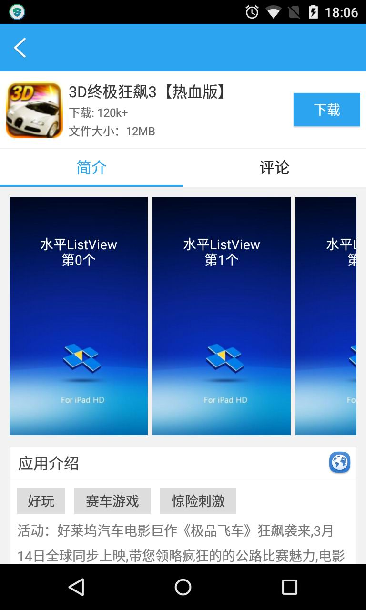

这是一个带有“粘性”功能的viewpager。
viewpager左右滑动的时候，始终有一个view“粘”在顶部。Viewpager左边fragment是scrollView，右边是listview。左右两个fragment上下滑动的时候，stickyView会动态调整位置。在viewpager左右滑动的时候，两个fragment的stickyView高度之间的契合也做了调整。在豌豆荚和应用宝的app详情页界面，对stickyView的处理太过生硬，用户体验不太友好。可以参考这个demo的实现方案。
先上两张图如下：

<td>
  
  
</td>

viewpager在上下滑动的时候，对stickyview位置的改变，会存在惯性。大多bug已经修复完成，滑动比较流畅。欢迎拍砖~

备注：
该project使用的水平listview是：https://github.com/MeetMe/Android-HorizontalListView --(只修改了dispatchTouchEvent方法) 
viewpager指示器是：https://github.com/astuetz/PagerSlidingTabStrip
