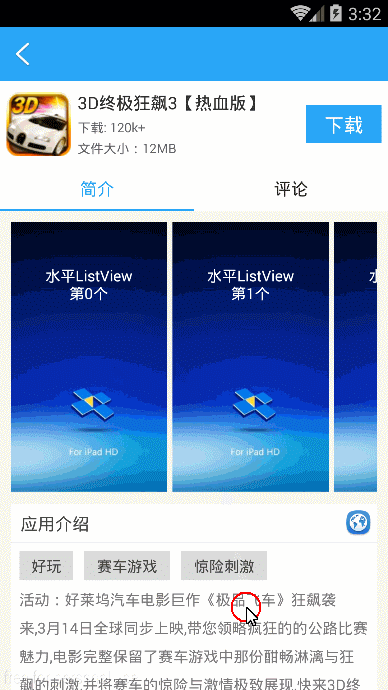
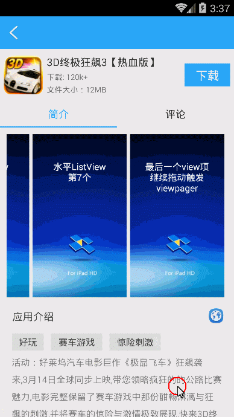

这是一个带有“粘性”功能的viewpager。  
ViewPager带有粘性功能，常规的处理方法可能会超级复杂，因为涉及到大量的onTouch监听、拦截，滑动时因为效率问题影响用户体验，不信你去看一下应用宝、豌豆荚的App详情页，然后滑动一下试试。  
但是这个demo却使用了很讨巧的方法，里面很少看到onTouch拦截、事件消费的逻辑处理。细看代码你会发现，这个demo使用了障眼法，很巧妙的障眼法。这个障眼法的灵感，来源于另外一款App的处理逻辑，我在滑动时不小心琢磨到了。我没有去反编译，没有去看代码，却猜到了大体的框架，这真是一件很有意思的事情。  
viewpager左右滑动的时候，始终有一个view“粘”在顶部。Viewpager左边fragment是scrollView，右边是listview。左右两个fragment上下滑动的时候，都会计算并动态调整stickyView的位置。在viewpager左右滑动的时候，两个fragment的stickyView高度之间的契合也做了调整。在豌豆荚和应用宝的app详情页界面，对stickyView的处理太过生硬，用户体验不太友好。可以参考这个demo的实现方案。  
先上两张图如下：  
<td>
  
  
</td>

viewpager在上下滑动的时候，对stickyview位置的改变，会存在惯性。大多bug已经修复完成，滑动比较流畅。欢迎拍砖~ 

备注： 
该project使用的水平listview是：https://github.com/MeetMe/Android-HorizontalListView --(只修改了dispatchTouchEvent方法) 
viewpager指示器是：https://github.com/astuetz/PagerSlidingTabStrip
